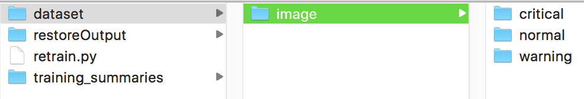
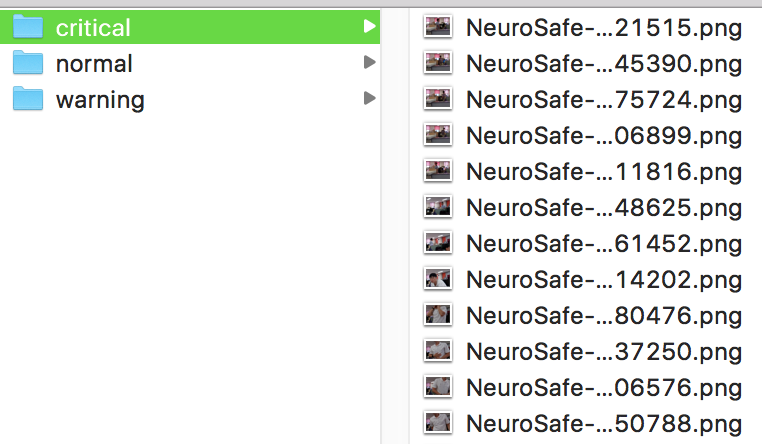
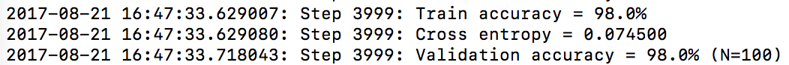
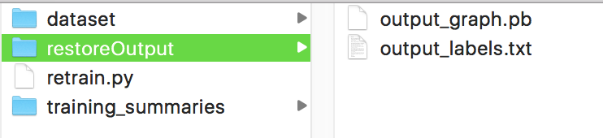
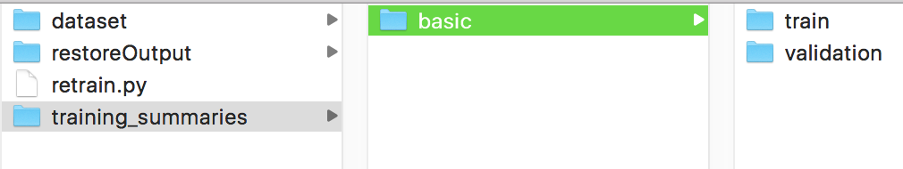
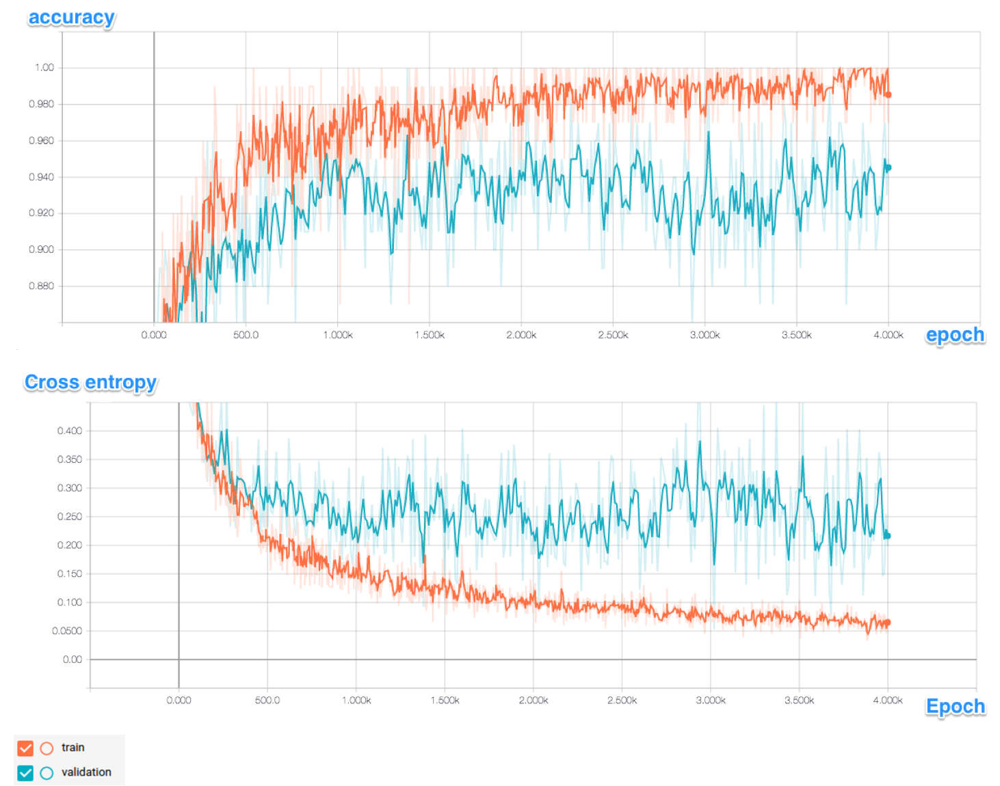
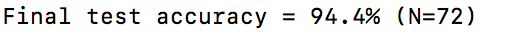
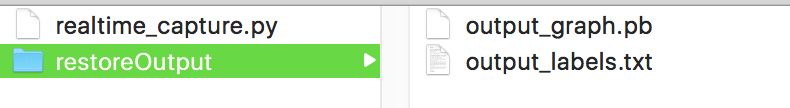
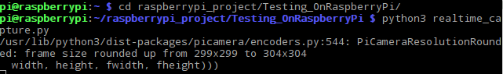
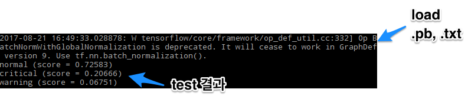

# raspi-tf-hd
Raspberrypi3 &amp; TensorFlow &amp; Human Detection  

the dataset is in following url 
<a href="https://drive.google.com/open?id=0B7yTjMaXa4l1MkV1akJwMy1pSzA">click here</a>  

## Contents
<ul>
    <li><a href="#2">설치과정</a></li>
    <li><a href="#3">개요</a></li>
    <li><a href="#4">예제</a></li>
    <li><a href="#5">Reference</a></li>
</ul>

# 환경 
Raspberry Pi 3  
OS: Raspbian 8.0 (“Jessie”) 
Python version : 3.4.2 
TensorFlow version : 1.1.0 
openCV : 3.2.0 

 

# 설치과정

### Installing Library needed 
<pre>
$ sudo su -
$ apt-get update
$ apt-get install python3-matplotlib
$ apt-get install python3-scipy
$ apt-get install python3-numpy
$ pip3 install --upgrade pip
$ reboot
</pre>
 

### Installing TensorFlow

 

<pre>
$ sudo apt-get install python3-pip python3-dev
$ wget https://github.com/samjabrahams/tensorflow-on-raspberry-pi/releases/download/v1.1.0/tensorflow-1.1.0-cp34-cp34m-linux_armv7l.whl
$ sudo pip3 install tensorflow-1.1.0-cp34-cp34m-linux_armv7l.whl
$ sudo pip3 uninstall mock
$ sudo pip3 install mock
</pre>
 
### Installing openCV 
<pre>
$ sudo apt-get install build-essential cmake pkg-config libjpeg-dev libtiff5-dev libjasper-dev libpng12-dev libavcodec-dev libavformat-dev libswscale-dev libv4l-dev libxvidcore-dev libx264-dev libatlas-base-dev gfortran libgtk-3-dev python3-dev python3-pip python3-numpy
$ sudo update-alternatives --install /usr/bin/python python /usr/bin/python2.7 1
$ sudo update-alternatives --install /usr/bin/python python /usr/bin/python3.4 2
$ sudo update-alternatives --config python
$ wget -O opencv.zip https://github.com/Itseez/opencv/archive/3.2.0.zip; unzip opencv.zip
$ wget -O opencv_contrib.zip https://github.com/Itseez/opencv_contrib/archive/3.2.0.zip; unzip opencv_contrib.zip
$ cd ~/opencv-3.2.0/ ; mkdir build; cd build
$ cmake -D CMAKE_BUILD_TYPE=RELEASE -D CMAKE_INSTALL_PREFIX=/usr/local -D OPENCV_EXTRA_MODULES_PATH=~/opencv_contrib-3.2.0/modules -D PYTHON_DEFAULT_EXECUTABLE=python3 ..
$ make -j4
$ sudo make install; sudo ldconfig
$ cd /usr/local/lib/python3.4/site-packages/ ; sudo ln -s cv2.cpython-34m.so cv2.so
</pre>

 

 
# 개요

학습에 쓰이는 모델 : Inception v3 모델 
학습에 쓰이는 파일명 : retrain.py 
테스트에 쓰이는 파일명 : realtime_capture.py 

 

 
# 예제

### 준비 
파일과 동일한 폴더에 학습할 폴더 생성
<pre>
$ mkdir dataset
</pre>
 
##### 학습한 결과를 저장할 폴더 생성 
<pre>
$ mkdir restoreOutput
</pre>
 

##### 학습에 필요한 라벨명으로 디렉토리 생성
<pre>
$ cd dataset 
$ mkdir critical 
$ mkdir warning 
$ mkdir normal 
</pre>
 
 

##### 학습에 쓰일 이미지 데이터들을 각 폴더에 배치(jpg, png)
..
 
 
 

> 본 예제에서 제공하는 데이터셋의 개수는 다음과 같다. 
> critical: 337장 
> normal: 150장 
> warning: 188장 
> 총 675장
  
<h5>학습(Training) 시작</h5>
<pre>
$ python3 retrain.py --image_dir=./dataset/image/ \
--output_graph=./restoreOutput/output_graph.pb \
--output_labels=./restoreOutput/output_labels.txt
</pre>
 

> training 과정 중에는 반복적으로 output이 발생하는데, 매번 training accuracy, validation accuracy 그리고 cross entropy를 출력하게 된다.
 
> training accuracy는 현재 학습에 사용된 이미지를 얼마나 올바른 class로 라벨링하였는지를 나타내는 비율을 말한다.
> validation accuracy는 training에 쓰인 batch set이 아닌 다른 set의 이미지들을 랜덤하게 가져온 뒤, 그 이미지들에 대한 정확도를 측정한 것을 의미하며, 오버피팅(overfitting) 여부를 알아내기 위하여 쓰인다.
> (즉 training accuracy는 오로지 학습한 이미지 자체에만 기반을 두고 있기 때문에 training data에 섞여있을 noise들에 대해서 과적합(overfit)하도록 학습했을 것이다. 그러나 모델의 진정한 성능 측정치는 모델이 학습한 데이터에 대해서가 아니라 모델이 학습하지 않은 데이터에 대해서 성능을 측정함으로써 얻을 수 있으며 이 값을 validation accuracy라고 한다.)
> training accuracy와 validation accuracy에 의한 오버피팅 여부 확인에 대해서는 ‘<a href="#1">오버피팅</a>’섹션에서 다룸

 
<h5> 학습(Training) 결과</h5>
30분 정도의 학습이 끝나면 “restoreFolder"내에 .pb파일과 라벨링 정보가 들어있는 .txt 파일이 생성됨
 
  
pb파일과 txt파일에 원하는 이름을 부여하려면 
<pre>—output_graph=./restoreOoutput/NAME.pb \</pre>
<pre>—output_labels=./restoreOoutput/NAME.txt</pre>
  
원하는 이름을 부여할 경우, 테스트용 코드(realtime_caputure.py)에서도 수정 필요 
 
<h5> Tensorboard 실행 </h5>
텐서보드로 트레이닝 결과를 관찰하기 위해서는 
<pre>tensorboard --logdir training_summaries & python3 retrain.py …</pre> 에 이어서 
<pre>--summaries_dir=training_summaries/basic</pre> 입력 후 localhost:6006으로 접속

 
 
<h5 id="1">오버피팅(Overfitting) 확인</h5>
training accuracy가 validation accuracy보다 지속적으로 높게 나타난다면, 오버피팅되었음을 의미한다.
 
 

현재 데이터셋은 오버피팅되어 있다. 따라서 data augmentation이 필요하다. 
(단, 테스트를 수행할 때마다 결과는 달라질 수 있다.) 
 
> Cross entropy는 loss function으로서, 학습 과정이 잘 수행중인지를 관찰할 수 있게 해주는 지표다.
> training을 수행한 이유가 바로 loss function인 Cross entropy를 줄이기 위한 것인데, 텐서보드를 통해 관찰한 loss function 그래프가 downwards한 경향을 보인다면, learning이 잘 되고 있으며 학습과정 중에 마주치는 왠만한 noise는 무시하고 있기 때문에 generalization되었다고 할 수 있다.
 

<h3> 그 외</h3>
현재 기본적으로 iteration은 4000으로 설정되어 있기 때문에, 트레이닝 시간을 줄이기 위하여 다음의 명령어를 덧붙일 수 있음
<pre>--how_many_training_steps=500</pre>
 
> 각 스텝별로 training set으로부터 랜덤으로 10장의 이미지를 선택하여 학습을 한다. 이 때 back propagation 과정을 통해 final layer에 있는 가중치들을 업데이트한다. 즉 학습시에 예측한 결과 클래스와 ground truth 클래스를 비교하는 과정을 통해 final layer의 가중치 값을 더 적절하게 조정하게 된다.
  

<h5> 학습(Training) 결과</h5>
본 명령어를 돌린 후 가장 마지막의 결과로 출력되는 것은 training과 validation에 쓰인 data와는 별도로 분리된 데이터로 최종적으로 test를 수행한 test accuracy가 결과로 나온다. 이 결과값은 학습이 끝난 해당 모델이 낼 수 있는 가장 좋은 값이다. 보통 90%~95% 가량이 나온다.
 
  

<h5> 테스트(Testing) 준비</h5>
학습이 끝난 후 생성된 .pb파일과 .txt파일은 realtime_capture.py와 함께 라즈베리파이에 옮겨져야 함
 
  

<h5> 테스트(Testing) 시작<h5>
라즈베리파이상에서 다음의 명령어를 입력하여 카메라로 입력을 받은 결과로 테스트를 수행
 
<pre>
$ python3 realtime_capture.py
</pre>
  
<h5> 테스트(Testing) 결과</h5>
카메라 앞에서 최초의 움직임이 있을 경우, .pb파일과 .txt파일을 로드한 후, 
촬영된 이미지에 대한 테스트 결과 출력
 

<h1 id="5">Reference</h1>

https://github.com/samjabrahams/tensorflow-on-raspberry-pi
 
https://codelabs.developers.google.com/codelabs/tensorflow-for-poets/?utm_campaign=chrome_series_machinelearning_063016&utm_source=gdev&utm_medium=yt-desc#4
 
https://www.tensorflow.org/tutorials/image_retraining

